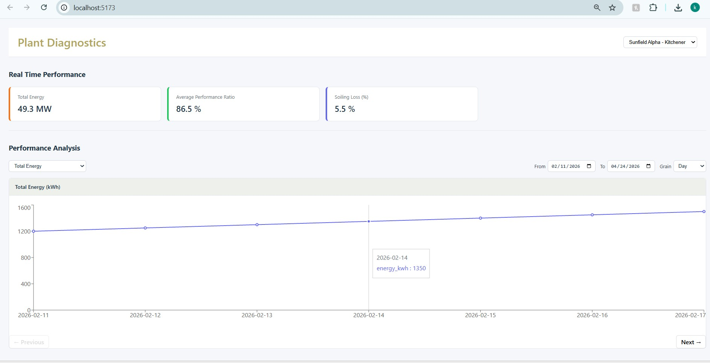

# Case_Study_V2
This repository demonstrates V2 development for a solar performance analytics platform.

## Dashboard


## Architecture Overview

## Frontend

- React + TypeScript

- Vite for fast development and build

- Recharts for time-series data visualization

- Window Based chart pagination (displays 7 data points at a time)
  
- Component-based UI with reusable sections:
   
  - Header

  - KPI cards

  - Filters (date range + grain)

  - Metric selector

  - Chart container

## Backend

 - FastAPI

  - Pydantic for request/response validation

  - Mock data generator to simulate plant performance data

  - REST endpoint serving time-series metrics based on:

  - Date range

  - Grain (day / week / monthly)

### Backend API Example

```
GET /plants/{plant_id}/performance?from=2026-02-11&to=2026-02-18&grain=day
```

### Response (example)

```
{
  "plant_id": "plant_123",
  "grain": "day",
  "metrics": [
    {
      "date": "2026-02-11",
      "energy_kwh": 1200,
      "pr": 0.86,
      "soiling_loss_percentage": 2.8
    }
  ]
}

```

## How to Run the Project

### Backend
```
cd backend
pip install -r requirements.txt
uvicorn main:app --reload
```
Runs on:
http://localhost:8000

### Frontend
```
cd frontend
npm install
npm run dev
```
Runs on:
http://localhost:5173


##  Performance & Scale Thinking 

### 1. What part of your solution will break first as data scales?
- Backend response size and computation time would become the next bottleneck as the date range and number of metrics grow.
- Even with pagination, returning very large datasets in a single API response would increase network payload size and slow down responses.
- Additionally, if the data updates frequently, automatically refetching it could cause the chart to reset and jump back to the starting view, which would interrupt the user’s experience.
    
### 2. What did you intentionally not implement, and why?
- Caching – skipped to keep the backend simple.
- Live streaming / real-time updates – not required for the assignment and would add unnecessary complexity.
- Global state management – The application scope is small and the state is localized, so React’s local state was sufficient without adding extra complexity.

### 3. What would you change if this API had a 3-second latency?
- Add loading indicators so the UI remains responsive.
- Debounce filter changes to prevent unnecessary requests when users adjust inputs quickly.
- Introduce backend caching (Redis) or pre-aggregated metrics.

### 4. What assumptions are you making about the data layer?
- Metric values are pre-computed (e.g., PR, soiling loss) rather than calculated on the fly.
- Timestamps are consistent and use a single time zone.
- Missing or invalid data points are handled before reaching the API.
    
  

  


